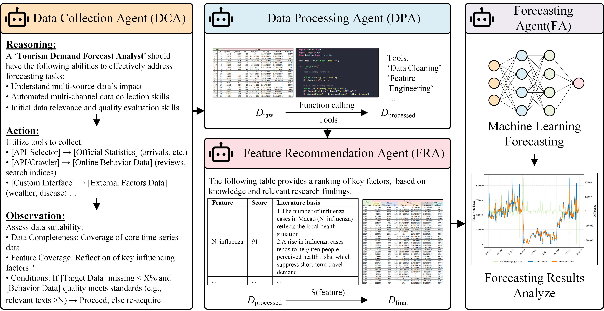

# TDF-Agents: A Multi-Agent Collaborative Framework for Tourism Demand Forecasting

  

## Introduction

In the post-pandemic era, tourists' perception of travel health risks has reached unprecedented levels, causing traditional tourism demand forecasting models to frequently fail due to their inability to effectively respond to drastic fluctuations triggered by public health emergencies. To address this challenge, this project proposes **TDF-Agents**, an end-to-end multi-agent collaborative framework based on large language models (LLMs).

TDF-Agents aims to overcome the limitations of traditional forecasting models by automating the entire workflow from multi-source data acquisition, processing, and feature recommendation to final prediction. The framework can integrate and analyze complex features, including online sentiment and multidimensional risks, to accurately characterize and explain the dynamic changes in tourism demand in the post-pandemic era.

## Framework Architecture

TDF-Agents adopts the "Perception-Thinking-Decision-Execution" design principle, decomposing complex forecasting tasks into four core collaborative agents to form an efficient, automated workflow.


*Figure 1: The TDF-Agents Framework*

### Core Agent Responsibilities

*   **Data Collection Agent (DCA):** As the "Perception Layer", it automatically fetches and integrates multi-source heterogeneous data from various external sources (APIs, web, etc.) according to user tasks, ensuring real-time and comprehensive data acquisition.
*   **Data Processing Agent (DPA):** As the "Thinking Layer", it receives raw data and performs standardized cleaning, alignment, and transformation. It utilizes built-in programmatic tools and code generation capabilities to create high-quality candidate feature sets.
*   **Feature Recommendation Agent (FRA):** As the "Decision Layer", it deeply evaluates and filters candidate features based on its embedded, extensible RAG academic knowledge base, ultimately outputting a structured feature set with high impact and theoretical support.
*   **Forecasting Agent (FA):** As the "Execution Layer", it receives the recommended feature set and autonomously selects, trains, and evaluates various time series models (such as CNN, LSTM, TimesNet, etc.), generating the final tourism demand forecast results and analysis report.

## Main Contributions

*   **Methodological Contribution:** For the first time, introduces a multi-agent collaborative framework to the field of tourism demand forecasting, proposing a fully automated end-to-end forecasting framework. This framework reconstructs the technical path of traditional research, providing an efficient, interpretable, and scalable solution for tourism management studies.
*   **Feature Contribution:** Establishes a data processing paradigm that includes multi-source heterogeneous features such as health risks and online sentiment, significantly improving the accuracy and robustness of forecasts. Through quantitative analysis, it identifies structural changes in key influencing factors before and after major public health events, offering new decision-making insights into the impact of sudden crises on tourist behavior.

## Installation

1.  **Clone the repository:**
    ```bash
    git clone https://github.com/Kon-Kwok/TDF-Agents.git
    cd TDF-Agents
    ```

2.  **Install dependencies:**
    It is recommended to perform this step in a virtual environment to avoid package version conflicts.
    ```bash
    pip install -r requirements.txt
    ```

## Usage

1.  **Configure environment variables:**
    Copy the `.env.example` file to `.env` and fill in the required API keys and configuration information.
    ```bash
    cp .env.example .env
    ```

2.  **Run the main program:**
    Run `main.py` from the project root directory to start the complete forecasting workflow.
    ```bash
    python main.py
    ```
    The framework will automatically execute the workflow of all agents and generate the final forecast results and analysis according to the configuration.

